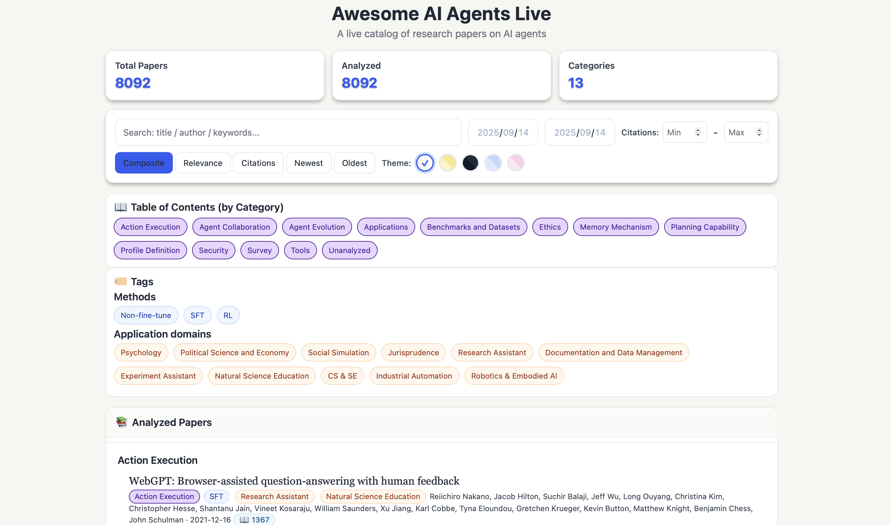

## Awesome AI Agents Live

**A live catalog of research papers on AI agents**

**Live catalog:** [https://saifs-aihub.github.io/Awesome-AI-Agents-Live/](https://saifs-aihub.github.io/Awesome-AI-Agents-Live/)

A lightweight, continuously-updated catalog of research papers on AI agents. The site aggregates recent work and provides a clean reading experience with search, filtering, category navigation, and quick detail views.

### Preview
Two representative UI snapshots for quick reference.

### What this project is
- **Dynamic agent paper browser**: Explore recent AI agent papers with fast keyword search and simple filters.
- **At-a-glance insights**: Each analyzed paper includes a short summary, key insights, pros/cons, labels, and publication metadata.
- **Practical navigation**: Switch between list and detail views, jump using the mini-TOC, and sort by relevance, recency, citations or a composite score.
- **Regularly updated**: Designed to ingest new papers on a frequent cadence (daily-targeted).

### Categories and labels
The category and label schema (e.g., Profile Definition, Memory Mechanism, Planning Capability, Action Execution, Agent Collaboration, Applications, Benchmarks and Datasets, Tools, Security, Ethics, Survey) draws from recent surveys on LLM-based agents, including:

- Luo et al., [Large Language Model Agent: A Survey on Methodology, Applications and Challenges](http://arxiv.org/abs/2503.21460) (arXiv:2503.21460)

- Wang et al., [A Survey on Large Language Model based Autonomous Agents](https://link.springer.com/10.1007/s11704-024-40231-1) (Frontiers of Computer Science, 2024)

### Audience
Researchers, engineers, and students tracking the rapid progress of LLM-based agents will find this catalog useful for quick discovery and lightweight triage before deeper reading.

### Notes
- The web UI is optimized for readability and quick comparison across many papers.
- Citation counts displayed in the catalog are sourced via the [Semantic Scholar API](https://www.semanticscholar.org/product/api).
- Paper classifications and summaries are AI-generated and may contain inaccuracies; use discretion and refer to the original papers when needed.

### Acknowledgement
We gratefully acknowledge the instrumental computational support provided by [Hyper.ai](https://hyper.ai/cn). Its out-of-the-box computational capabilities and curated data repositories have been pivotal in enabling large-scale model training and experimentation. We also extend our thanks to the Hyper.ai engineering team for their expertise in deployment optimization and resource scheduling.

### Contacts

**Zonghan Wu**: zhwu@sem.ecnu.edu.cn

### License
This project is licensed under the MIT License. See [LICENSE](LICENSE) for details.

